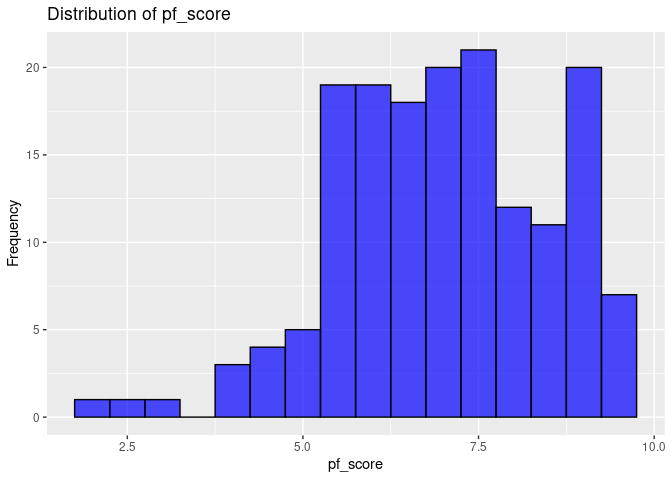
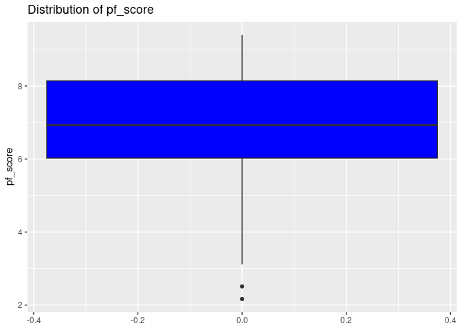
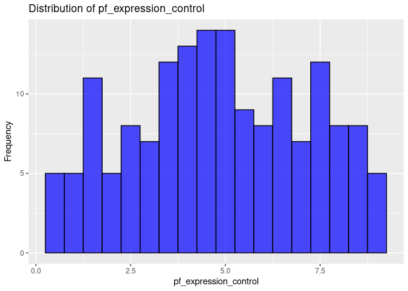
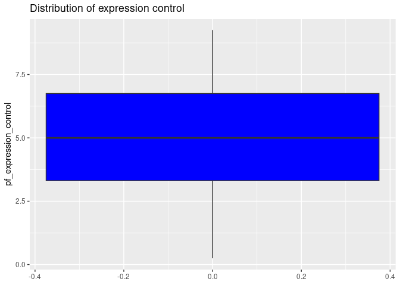
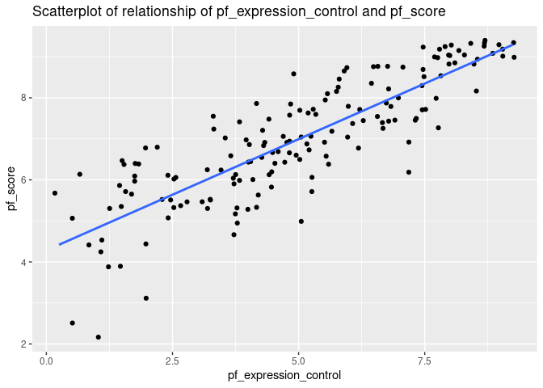
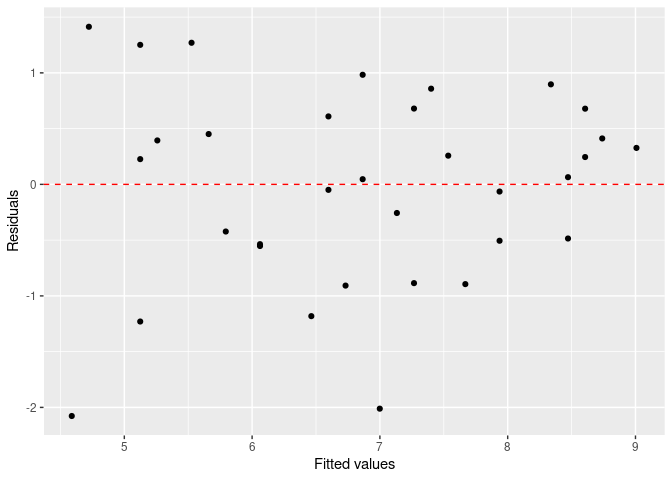
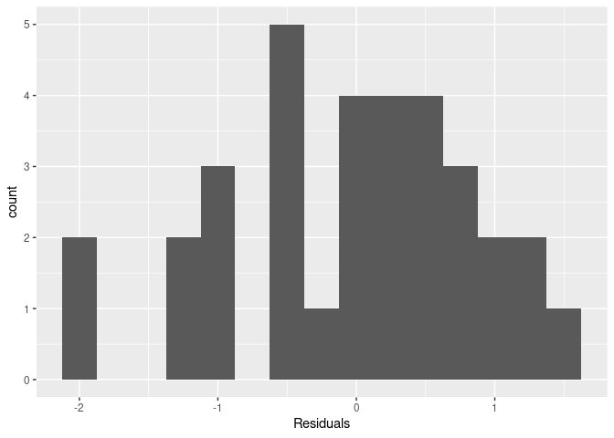

### A typical modeling process

The process that we will use for today's activity is:

1.  Identify our research question(s),
2.  Explore (graphically and with numerical summaries) the variables of interest - both individually and in relationship to one another,
3.  Fit a simple linear regression model to obtain and describe model estimates,
4.  Assess how "good" our model is, and
5.  Predict new values.

We will continue to update/tweak/adapt this process and you are encouraged to build your own process.
Before we begin, we set up our R session and introduce this activity's data.

## Day 1

### The setup

We will be using two packages from Posit (formerly [RStudio](https://posit.co/)): `{tidyverse}` and `{tidymodels}`.
If you would like to try the *ISLR* labs using these two packages instead of base R, [Emil Hvitfeldt](https://www.emilhvitfeldt.com/) (of Posit) has put together a [complementary online text](https://emilhvitfeldt.github.io/ISLR-tidymodels-labs/index.html).

-   In the **Packages** pane of RStudio (same area as **Files**), check to see if `{tidyverse}` and `{tidymodels}` are installed.
    Be sure to check both your **User Library** and **System Library**.

-   If either of these are not currently listed, type the following in your **Console** pane, replacing `package_name` with the appropriate name, and press Enter/Return afterwards.

    
    ```r
    # Note: the "eval = FALSE" in the above line tells R not to evaluate this code
    install.packages("package_name")
    ```

-   Once you have verified that both `{tidyverse}` and `{tidymodels}` are installed, load these packages in the R chunk below titled `setup`.
    That is, type the following:

    
    ```r
    library(tidyverse)
    library(tidymodels)
    ```

-   Run the `setup` code chunk and/or **knit**  icon your Rmd document to verify that no errors occur.


```r
library(tidyverse)
```

```
## ── Attaching core tidyverse packages ──────────────────────── tidyverse 2.0.0 ──
## ✔ dplyr     1.1.2     ✔ readr     2.1.4
## ✔ forcats   1.0.0     ✔ stringr   1.5.0
## ✔ ggplot2   3.4.2     ✔ tibble    3.2.1
## ✔ lubridate 1.9.2     ✔ tidyr     1.3.0
## ✔ purrr     1.0.1     
## ── Conflicts ────────────────────────────────────────── tidyverse_conflicts() ──
## ✖ dplyr::filter() masks stats::filter()
## ✖ dplyr::lag()    masks stats::lag()
## ℹ Use the conflicted package (<http://conflicted.r-lib.org/>) to force all conflicts to become errors
```

```r
library(tidymodels)
```

```
## ── Attaching packages ────────────────────────────────────── tidymodels 1.1.0 ──
## ✔ broom        1.0.5     ✔ rsample      1.1.1
## ✔ dials        1.2.0     ✔ tune         1.1.1
## ✔ infer        1.0.4     ✔ workflows    1.1.3
## ✔ modeldata    1.1.0     ✔ workflowsets 1.0.1
## ✔ parsnip      1.1.0     ✔ yardstick    1.2.0
## ✔ recipes      1.0.6     
## ── Conflicts ───────────────────────────────────────── tidymodels_conflicts() ──
## ✖ scales::discard() masks purrr::discard()
## ✖ dplyr::filter()   masks stats::filter()
## ✖ recipes::fixed()  masks stringr::fixed()
## ✖ dplyr::lag()      masks stats::lag()
## ✖ yardstick::spec() masks readr::spec()
## ✖ recipes::step()   masks stats::step()
## • Dig deeper into tidy modeling with R at https://www.tmwr.org
```

```r
library(skimr)
```

 **Check in**

Test your GitHub skills by staging, committing, and pushing your changes to GitHub and verify that your changes have been added to your GitHub repository.

### The data

The data we're working with is from the OpenIntro site: `https://www.openintro.org/data/csv/hfi.csv`.
Here is the "about" page: <https://www.openintro.org/data/index.php?data=hfi>.

In the R code chunk below titled `load-data`, you will type the code that reads in the above linked CSV file by doing the following:

-   Rather than downloading this file, uploading to RStudio, then reading it in, explore how to load this file directly from the provided URL with `readr::read_csv` (`{readr}` is part of `{tidyverse}`).

-   Assign this data set into a data frame named `hfi` (short for "Human Freedom Index").

-   Ignore above\^\^\^ Push this data to Github, use upload button from files pane to upload to activity02-slr folder.


```r
hfi <- readr::read_csv("hfi.csv")
```

```
## Rows: 1458 Columns: 123
## ── Column specification ────────────────────────────────────────────────────────
## Delimiter: ","
## chr   (3): ISO_code, countries, region
## dbl (120): year, pf_rol_procedural, pf_rol_civil, pf_rol_criminal, pf_rol, p...
## 
## ℹ Use `spec()` to retrieve the full column specification for this data.
## ℹ Specify the column types or set `show_col_types = FALSE` to quiet this message.
```

```r
head(hfi)
```

```
## # A tibble: 6 × 123
##    year ISO_code countries region pf_rol_procedural pf_rol_civil pf_rol_criminal
##   <dbl> <chr>    <chr>     <chr>              <dbl>        <dbl>           <dbl>
## 1  2016 ALB      Albania   Easte…              6.66         4.55            4.67
## 2  2016 DZA      Algeria   Middl…             NA           NA              NA   
## 3  2016 AGO      Angola    Sub-S…             NA           NA              NA   
## 4  2016 ARG      Argentina Latin…              7.10         5.79            4.34
## 5  2016 ARM      Armenia   Cauca…             NA           NA              NA   
## 6  2016 AUS      Australia Ocean…              8.44         7.53            7.36
## # ℹ 116 more variables: pf_rol <dbl>, pf_ss_homicide <dbl>,
## #   pf_ss_disappearances_disap <dbl>, pf_ss_disappearances_violent <dbl>,
## #   pf_ss_disappearances_organized <dbl>,
## #   pf_ss_disappearances_fatalities <dbl>, pf_ss_disappearances_injuries <dbl>,
## #   pf_ss_disappearances <dbl>, pf_ss_women_fgm <dbl>,
## #   pf_ss_women_missing <dbl>, pf_ss_women_inheritance_widows <dbl>,
## #   pf_ss_women_inheritance_daughters <dbl>, pf_ss_women_inheritance <dbl>, …
```

After doing this and viewing the loaded data, answer the following questions:

1.  What are the dimensions of the dataset? What does each row represent?

Dimensions are 1458 x 123 (rows x cols).
Each row is a country in a given year and its associated variables.

The dataset spans a lot of years.
We are only interested in data from year 2016.
In the R code chunk below titled `hfi-2016`, type the code that does the following:

-   Filter the data `hfi` data frame for year 2016, and
-   Assigns the result to a data frame named `hfi_2016`.


```r
hfi_2016 <- hfi %>% filter(year == 2016)
hfi_2016
```

```
## # A tibble: 162 × 123
##     year ISO_code countries  region               pf_rol_procedural pf_rol_civil
##    <dbl> <chr>    <chr>      <chr>                            <dbl>        <dbl>
##  1  2016 ALB      Albania    Eastern Europe                    6.66         4.55
##  2  2016 DZA      Algeria    Middle East & North…             NA           NA   
##  3  2016 AGO      Angola     Sub-Saharan Africa               NA           NA   
##  4  2016 ARG      Argentina  Latin America & the…              7.10         5.79
##  5  2016 ARM      Armenia    Caucasus & Central …             NA           NA   
##  6  2016 AUS      Australia  Oceania                           8.44         7.53
##  7  2016 AUT      Austria    Western Europe                    8.97         7.87
##  8  2016 AZE      Azerbaijan Caucasus & Central …             NA           NA   
##  9  2016 BHS      Bahamas    Latin America & the…              6.93         6.01
## 10  2016 BHR      Bahrain    Middle East & North…             NA           NA   
## # ℹ 152 more rows
## # ℹ 117 more variables: pf_rol_criminal <dbl>, pf_rol <dbl>,
## #   pf_ss_homicide <dbl>, pf_ss_disappearances_disap <dbl>,
## #   pf_ss_disappearances_violent <dbl>, pf_ss_disappearances_organized <dbl>,
## #   pf_ss_disappearances_fatalities <dbl>, pf_ss_disappearances_injuries <dbl>,
## #   pf_ss_disappearances <dbl>, pf_ss_women_fgm <dbl>,
## #   pf_ss_women_missing <dbl>, pf_ss_women_inheritance_widows <dbl>, …
```

```r
hfi_2016 <- hfi_2016 %>% select(pf_score,pf_expression_control)
```

### 1. Identify our research question(s)

The research question is often defined by you (or your company, boss, etc.).
Today's research question/goal is to predict a country's personal freedom score in 2016.

For this activity we want to explore the relationship between the personal freedom score, `pf_score`, and the political pressures and controls on media content index,`pf_expression_control`.
Specifically, we are going to use the political pressures and controls on media content index to predict a country's personal freedom score in 2016.

### 2. Explore the variables of interest

Answer the following questions (use your markdown skills) and complete the following tasks.

2.  What type of plot would you use to display the distribution of the personal freedom scores, `pf_score`? Would this be the same type of plot to display the distribution of the political pressures and controls on media content index, `pf_expression_control`?

**-   I would use a histogram for pf_score. I would also use a histogram for expression control. We could also use a box and whisker plot for spread and outliers.**

-   In the R code chunk below titled `univariable-plots`, type the R code that displays this plot for `pf_score`.

-   In the R code chunk below titled `univariable-plots`, type the R code that displays this plot for `pf_expression_control`.


```r
#use ggplot for histogram of pf_score
ggplot(hfi_2016, aes(x = pf_score)) +
  geom_histogram(binwidth = .5, fill = "blue", color = "black", alpha = 0.7) +
  labs(title = "Distribution of pf_score",
       x = "pf_score",
       y = "Frequency")
```

<!-- -->

```r
#let's also do a box plot:
ggplot(hfi_2016, aes(y = pf_score)) +
  geom_boxplot(fill = "blue") +
  labs(title = "Distribution of pf_score")
```

<!-- -->

```r
#now for expression control: 
ggplot(hfi_2016, aes(x = pf_expression_control)) +
  geom_histogram(binwidth = .5, fill = "blue", color = "black", alpha = 0.7) +
  labs(title = "Distribution of pf_expression_control",
       x = "pf_expression_control",
       y = "Frequency")
```

<!-- -->

```r
#let's also do a box plot for expression control:
ggplot(hfi_2016, aes(y = pf_expression_control)) +
  geom_boxplot(fill = "blue") +
  labs(title = "Distribution of expression control")
```

<!-- -->

4.  Comment on each of these two distributions. Be sure to describe their centers, spread, shape, and any potential outliers.

**-   pf_score has a left-skewed distribution (peak farther from zero, over to right). It has a median of \~7 and half of the rows is between 8 and 6. Two potential outliers around 2.5 but nothing unusual about these scores. The shape is peaky and bimodal, one peak around the median and another around 9.**

**-   pf_expression_control has no outliers and is not skewed. It is roughly unimodal and pretty evenly distributed about the median near 5.**

5.  What type of plot would you use to display the relationship between the personal freedom score, `pf_score`, and the political pressures and controls on media content index,`pf_expression_control`?

**-   I would likely use a scatter plot with a line of best fit.**

-   In the R code chunk below titled `relationship-plot`, plot this relationship using the variable `pf_expression_control` as the predictor/explanatory variable.


```r
#plotting with geom_point for scatter plot
ggplot(hfi_2016, aes(x = pf_expression_control, y = pf_score)) +
  geom_point() +
  labs(x = "pf_expression_control", 
       y = "pf_score",
       title = "Scatterplot of relationship of pf_expression_control and pf_score")
```

<!-- -->

```r
#let's fix that overplotting and add 
ggplot(hfi_2016, aes(x = pf_expression_control, y = pf_score)) +
  geom_jitter() + #jitter fixes overplotting
  labs(x = "pf_expression_control", 
       y = "pf_score",
       title = "Scatterplot of relationship of pf_expression_control and pf_score") +
  geom_smooth(method = "lm", se = FALSE) #linear model for line, suppress error bars
```

```
## `geom_smooth()` using formula = 'y ~ x'
```

<!-- -->

4.  Does the relationship look linear? If you knew a country's `pf_expression_control`, or its score out of 10, with 0 being the most, of political pressures and controls on media content, would you be comfortable using a linear model to predict the personal freedom score?

**-   I would say the relationship is linear. Of course this is not a perfect predictor, but it is reasonable to use a linear model.**

#### Challenge

For each plot and using your `{dplyr}` skills, obtain the appropriate numerical summary statistics and provide more detailed descriptions of these plots.
For example, in (4) you were asked to comment on the center, spread, shape, and potential outliers.
What measures could/should be used to describe these?

**-   IQR and median describe the middle and middle 50% of the data. Shape is unimodal or bimodal in these cases.**

You might not know of one for each of those terms.

What numerical summary would you use to describe the relationship between two numerical variables?
(hint: explore the `cor` function from Base R)


```r
#let's look at these summary stats for pf_score and pf_expression_control with skim()
hfi_2016 %>% 
  select(pf_score, pf_expression_control) %>%
  skim()
```


Table: Data summary

|                         |           |
|:------------------------|:----------|
|Name                     |Piped data |
|Number of rows           |162        |
|Number of columns        |2          |
|_______________________  |           |
|Column type frequency:   |           |
|numeric                  |2          |
|________________________ |           |
|Group variables          |None       |


**Variable type: numeric**

|skim_variable         | n_missing| complete_rate| mean|   sd|   p0|  p25|  p50|  p75| p100|hist  |
|:---------------------|---------:|-------------:|----:|----:|----:|----:|----:|----:|----:|:-----|
|pf_score              |         0|             1| 6.98| 1.49| 2.17| 6.03| 6.93| 8.14| 9.40|▁▁▇▇▆ |
|pf_expression_control |         0|             1| 4.98| 2.32| 0.25| 3.31| 5.00| 6.75| 9.25|▅▅▇▅▆ |

```r
#now we'll see the correlation between the variables (OUTCOME ON LEFT, PREDICTOR ON RIGHT)
hfi_2016 %>% 
  summarize(correlation = cor(pf_score, pf_expression_control))
```

```
## # A tibble: 1 × 1
##   correlation
##         <dbl>
## 1       0.845
```

**-   A correlation coefficient is a quantitative expression of the strength of the linear relationship between two numerical variables. Its value ranges between -1 and 1. Here, the correlation coefficient is \~.85, which is quite high.**

### 3. Fit a simple linear regression model

Regardless of your response to (4), we will continue fitting a simple linear regression (SLR) model to these data.
The code that we will be using to fit statistical models in this course use `{tidymodels}` - an opinionated way to fit models in R - and this is likely new to most of you.
I will provide you with example code when I do not think you should know what to do - i.e., anything `{tidymodels}` related.

To begin, we will create a `{parsnip}` specification for a linear model.

-   In the code chunk below titled `parsnip-spec`, replace "verbatim" with "r" just before the code chunk title.


```r
lm_spec <- linear_reg() %>%
  set_mode("regression") %>%
  set_engine("lm")

lm_spec
```

```
## Linear Regression Model Specification (regression)
## 
## Computational engine: lm
```

Note that the `set_mode("regression")` is really unnecessary/redundant as linear models (`"lm"`) can only be regression models.
It is better to be explicit as we get comfortable with this new process.
Remember that you can type `?function_name` in the R **Console** to explore a function's help documentation.

The above code also outputs the `lm_spec` output.
This code does not do any calculations by itself, but rather specifies what we plan to do.

Using this specification, we can now fit our model: $\texttt{pf\score} = \beta_0 + \beta_1 \times \texttt{pf\_expression\_control} + \varepsilon$.
Note, the "\$" portion in the previous sentence is LaTeX snytex which is a math scripting (and other scripting) language.
I do not expect you to know this, but you will become more comfortable with this.
Look at your knitted document to see how this syntax appears.

-   In the code chunk below titled `fit-lm`, replace "verbatim" with "r" just before the code chunk title.


```r
slr_mod <- lm_spec %>% 
  fit(pf_score ~ pf_expression_control, data = hfi_2016)

tidy(slr_mod)
```

```
## # A tibble: 2 × 5
##   term                  estimate std.error statistic  p.value
##   <chr>                    <dbl>     <dbl>     <dbl>    <dbl>
## 1 (Intercept)              4.28     0.149       28.8 4.23e-65
## 2 pf_expression_control    0.542    0.0271      20.0 2.31e-45
```

The above code fits our SLR model, then provides a `tidy` parameter estimates table.

5.  Using the `tidy` output, update the below formula with the estimated parameters. That is, replace "intercept" and "slope" with the appropriate values

$\hat{\texttt{pf\score}} = 4.2838153 + 0.5418452 \times \texttt{pf\_expression\_control}$

6.  Interpret each of the estimated parameters from (5) in the context of this research question. That is, what do these values represent?

**- The interpretation for the intercept is:" A country with a pf_expression_control score of 0 would be predicted to have an average pf_score of 4.28..." - The interpretation for the slope is: "For every 1 unit increase in pf_expression_control, there is an associated increase of, on average, .54... units of pf_score."**

## Day 2

Hopefully, you were able to interpret the SLR model parameter estimates (i.e., the *y*-intercept and slope) as follows:

> For countries with a `pf_expression_control` of 0 (those with the largest amount of political pressure on media content), we expect their mean personal freedom score to be 4.28.

> For every 1 unit increase in `pf_expression_control` (political pressure on media content index), we expect a country's mean personal freedom score to increase 0.542 units.

### 4. Assessing

#### 4.A: Assess with your Day 1 model

To assess our model fit, we can use $R^2$ (the coefficient of determination), the proportion of variability in the response variable that is explained by the explanatory variable.
We use `glance` from `{broom}` (which is automatically loaded with `{tidymodels}` - `{broom}` is also where `tidy` is from) to access this information.

-   In the code chunk below titled `glance-lm`, replace "verbatim" with "r" just before the code chunk title.


```r
glance(slr_mod)
```

```
## # A tibble: 1 × 12
##   r.squared adj.r.squared sigma statistic  p.value    df logLik   AIC   BIC
##       <dbl>         <dbl> <dbl>     <dbl>    <dbl> <dbl>  <dbl> <dbl> <dbl>
## 1     0.714         0.712 0.799      400. 2.31e-45     1  -193.  391.  400.
## # ℹ 3 more variables: deviance <dbl>, df.residual <int>, nobs <int>
```

After doing this and running the code, answer the following questions:

7.  What is the value of $R^2$ for this model?

**-   The R^2 value for this model is .714**

8.  What does this value mean in the context of this model?
    Think about what would a "good" value of $R^2$ would be?
    Can/should this value be "perfect"?

**-   This means that the model we built explains ~71.4% of the variation in the response variable Y (pf_score). A good value is just a large-ish number, maybe something larger than .3 or so? This will never be perfect, it is still interesting to find 30% of pf_score can be predicted by one other measure like expression control, so 71% is a good result.**

#### 4.B: Assess with test/train

You previously fit a model and evaluated it using the exact same data.
This is a bit of circular reasoning and does not provide much information about the model's performance.
Now we will work through the test/train process of fitting and assessing a simple linear regression model.

Using the `diamonds` example provided to you in the Day 2 `README`, do the following

-   Create a new R code chunk and provide it with a descriptive tile (e.g., `train-test`).
-   Set a seed.
-   Create an initial 80-20 split of the `hfi_2016` dataset
-   Using your initial split R object, assign the two splits into a training R object and a testing R object.


```r
#set seed so random split is same each time we run
set.seed(123)
#split data into 80/20 split for train/test
hfi_split <- initial_split(hfi_2016,prop = .80)
#now assign portions to train and test
hfi_train <- training(hfi_split)
hfi_test <- testing(hfi_split)
```

Now, you will use your training dataset to fit a SLR model.

-   In the code chunk below titled `train-fit-lm`, replace "verbatim" with "r" just before the code chunk title and update the data set to your training R object you just created.


```r
slr_train <- lm_spec %>% 
  fit(pf_score ~ pf_expression_control, data = hfi_train)

tidy(slr_train)
```

```
## # A tibble: 2 × 5
##   term                  estimate std.error statistic  p.value
##   <chr>                    <dbl>     <dbl>     <dbl>    <dbl>
## 1 (Intercept)              4.32     0.166       26.1 7.85e-53
## 2 pf_expression_control    0.536    0.0299      17.9 1.41e-36
```

Notice that you can reuse the `lm_spec` specification because we are still doing a linear model.

9.  Using the `tidy` output, update the below formula with the estimated parameters. That is, replace "intercept" and "slope" with the appropriate values

$\hat{\texttt{pf\score}} = 4.32 + .536 \times \texttt{pf\_expression\_control}$

10. Interpret each of the estimated parameters from (10) in the context of this research question. That is, what do these values represent?

**-   The model estimates that a country with a pf_expression_control score of 0 will have an average pf_score of 4.32. **

**-   The model estimates that each increase of 1 in pf_expression_control will, on average, have an associated increase in pf_score of .536.**

Now we will assess using the testing data set.

-   In the code chunk below titled `glance-test`, replace "verbatim" with "r" just before the code chunk title and update `data_test` to whatever R object you assigned your testing data to above.


```r
test_aug <- augment(slr_train, new_data = hfi_test)
test_aug
```

```
## # A tibble: 33 × 4
##    pf_score pf_expression_control .pred .resid
##       <dbl>                 <dbl> <dbl>  <dbl>
##  1     5.28                  4     6.46 -1.18 
##  2     6.11                  2.5   5.66  0.451
##  3     6.14                  0.75  4.72  1.41 
##  4     7.43                  6.75  7.94 -0.506
##  5     7.21                  4.25  6.60  0.609
##  6     6.88                  5.25  7.13 -0.257
##  7     9.15                  8.25  8.74  0.412
##  8     7.99                  7.75  8.47 -0.485
##  9     5.35                  1.5   5.12  0.226
## 10     3.89                  1.5   5.12 -1.23 
## # ℹ 23 more rows
```

This takes your SLR model and applies it to your testing data.

 **Check in**

Look at the various information produced by this code.
Can you identify what each column represents?

**-   The `pf_score` column is simply the actual pf_score, same with `pf_expression_control`. The `.pred` is the predicted pf_score USING OUR MODEL. The `.resid` column is the residual (`.pred` - `pf_score`) for that particular row (country). **

The `.pred` column in this output can also be obtained by using `predict` (i.e., `predict(slr_fit, new_data = data_test)`)

11. Now, using your responses to (7) and (8) as an example, assess how well your model fits your testing data. Compare your results here to your results from your Day 1 of this activity. Did this model perform any differently?


```r
#let's assess model fit by just the train data
glance(slr_train)
```

```
## # A tibble: 1 × 12
##   r.squared adj.r.squared sigma statistic  p.value    df logLik   AIC   BIC
##       <dbl>         <dbl> <dbl>     <dbl>    <dbl> <dbl>  <dbl> <dbl> <dbl>
## 1     0.717         0.714 0.781      321. 1.41e-36     1  -150.  306.  315.
## # ℹ 3 more variables: deviance <dbl>, df.residual <int>, nobs <int>
```


**-   The results from today are almost exactly the same. The R^2 this time is almost the same, 71%.**


### Model diagnostics

To assess whether the linear model is reliable, we should check for (1) linearity, (2) nearly normal residuals, and (3) constant variability.
Note that the normal residuals is not really necessary for all models (sometimes we simply want to describe a relationship for the data that we have or population-level data, where statistical inference is not appropriate/necessary).

In order to do these checks we need access to the fitted (predicted) values and the residuals.
We can use `broom::augment` to calculate these.

-   In the code chunk below titled `augment`, replace "verbatim" with "r" just before the code chunk title and update `data_train` to whatever R object you assigned your testing data to above.


```r
#compare fit of train data on test data
train_aug <- augment(slr_train, new_data = hfi_test)

train_aug
```

```
## # A tibble: 33 × 4
##    pf_score pf_expression_control .pred .resid
##       <dbl>                 <dbl> <dbl>  <dbl>
##  1     5.28                  4     6.46 -1.18 
##  2     6.11                  2.5   5.66  0.451
##  3     6.14                  0.75  4.72  1.41 
##  4     7.43                  6.75  7.94 -0.506
##  5     7.21                  4.25  6.60  0.609
##  6     6.88                  5.25  7.13 -0.257
##  7     9.15                  8.25  8.74  0.412
##  8     7.99                  7.75  8.47 -0.485
##  9     5.35                  1.5   5.12  0.226
## 10     3.89                  1.5   5.12 -1.23 
## # ℹ 23 more rows
```

**Linearity**: You already checked if the relationship between `pf_score` and `pf_expression_control` is linear using a scatterplot.
We should also verify this condition with a plot of the residuals vs. fitted (predicted) values.

-   In the code chunk below titled `fitted-residual`, replace "verbatim" with "r" just before the code chunk title.


```r
ggplot(data = train_aug, aes(x = .pred, y = .resid)) +
  geom_point() +
  geom_hline(yintercept = 0, linetype = "dashed", color = "red") +
  xlab("Fitted values") +
  ylab("Residuals")
```

<!-- -->

Notice here that `train_aug` can also serve as a data set because stored within it are the fitted values ($\hat{y}$) and the residuals.
Also note that we are getting fancy with the code here.
After creating the scatterplot on the first layer (first line of code), we overlay a red horizontal dashed line at $y = 0$ (to help us check whether the residuals are distributed around 0), and we also rename the axis labels to be more informative.

Answer the following question:

11. Is there any apparent pattern in the residuals plot? What does this indicate about the linearity of the relationship between the two variables?

**-   It seems that the residuals are larger for smaller fitted values of X, but I do not see any relationship.**


**Nearly normal residuals**: To check this condition, we can look at a histogram of the residuals.

-   In the code chunk below titled `residual-histogram`, replace "verbatim" with "r" just before the code chunk title.


```r
#plot distribution of residuals
ggplot(data = train_aug, aes(x = .resid)) +
  geom_histogram(binwidth = 0.25) +
  xlab("Residuals")
```

<!-- -->

```r
#
```

Answer the following question:

12. Based on the histogram, does the nearly normal residuals condition appear to be violated? Why or why not?

**Constant variability**:

13. Based on the residuals vs. fitted plot, does the constant variability condition appear to be violated? Why or why not?

**-   It does not seem that this constant variability condition is violated, it is roughly normally distributed.**

## Attribution

This document is based on labs from [OpenIntro](https://www.openintro.org/).

<a rel="license" href="http://creativecommons.org/licenses/by-sa/4.0/"></a><br />This work is licensed under a <a rel="license" href="http://creativecommons.org/licenses/by-sa/4.0/">Creative Commons Attribution-ShareAlike 4.0 International License</a>.
